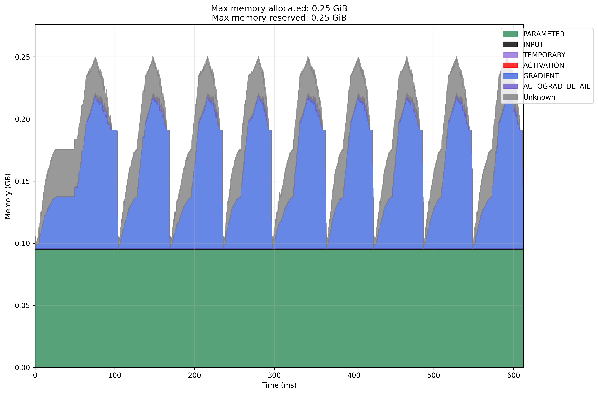
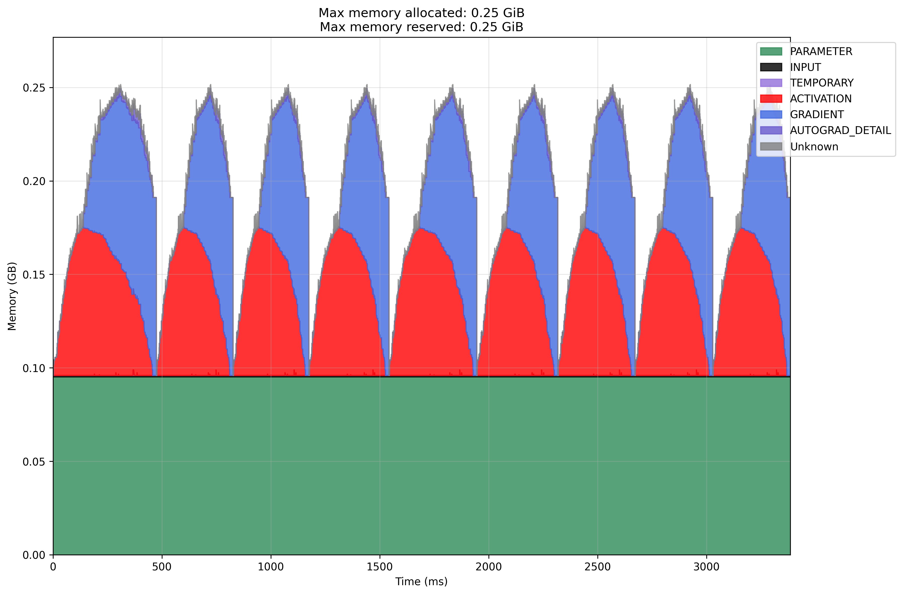
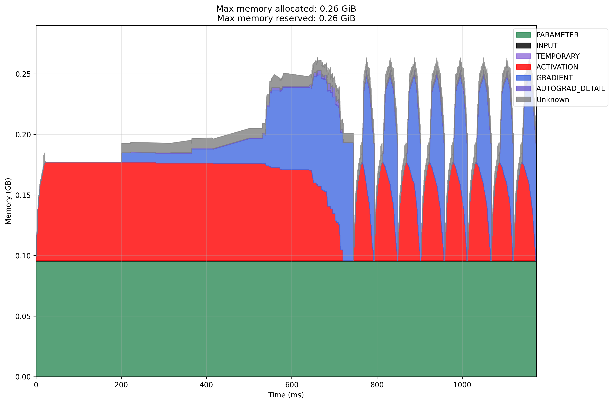
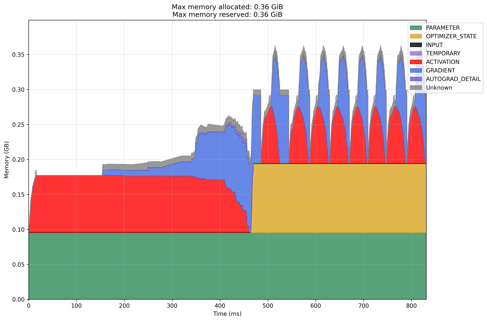
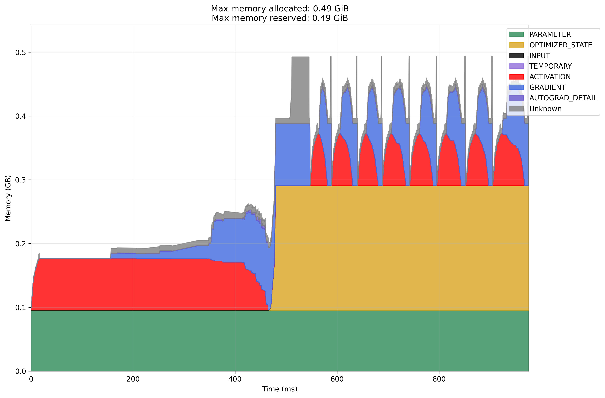
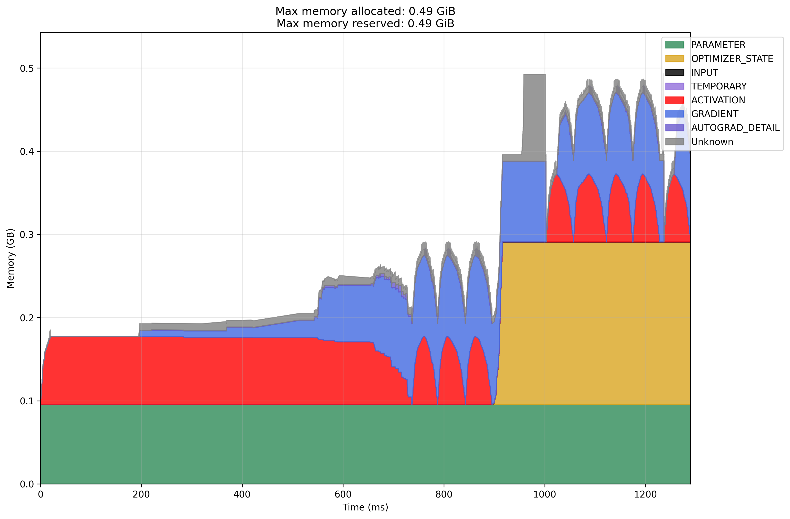

I ran the template PyTorch Memory Profile [code](https://pytorch.org/blog/understanding-gpu-memory-1/) in several settings.

| Execution Environment | Hardware Type | Optimizer | Gradient Accumulation | Memory Profile |
|----------------------|---------------|-----------|----------------------|----------------|
| Local | CPU | SGD | No | [View](#local-cpu-sgd) |
| Remote | CPU | SGD | No | [View](#modal-cpu-sgd) |
| Remote | GPU | SGD | No | [View](#modal-gpu-sgd) |
| Remote | GPU | SGD + Momentum | No | [View](#modal-gpu-sgd-with-momentum) |
| Remote | GPU | Adam | No | [View](#modal-gpu-adam) |
| Remote | GPU | Adam | Yes | [View](#modal-gpu-adam-with-gradient-accumulation) |

## Running the profiling

```
modal run profiling.py
```

## Notes

These are some observations
- I do not know why memory is not correctly attributed to activation in the Local CPU setting
- I probably want some explanation on why the first iteration on the GPU is slow
- I want to know what is the memory allocated to 'Unknown' is used for in Adam optimizer
- It seems that we should budget memory for 5 times the number of parameters
- There is also a [view](./snapshot.html) ([source](https://github.com/pytorch/pytorch.github.io/blob/site/assets/images/understanding-gpu-memory-1/snapshot.html)) on the specific memory usage

## Memory Profiling Results

### Local CPU SGD


### Modal CPU SGD


### Modal GPU SGD


### Modal GPU SGD with Momentum


### Modal GPU Adam


### Modal GPU Adam with Gradient Accumulation

